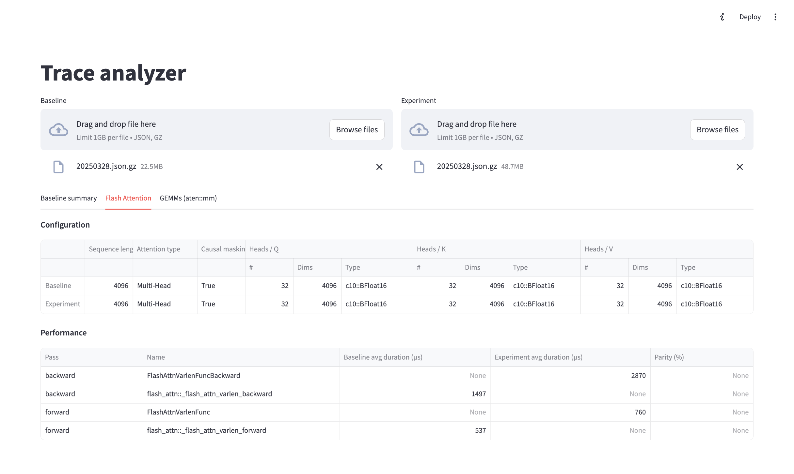

# Trace analyser UI



- install TraceLens via `pip install -e .` from the root folder
- `pip install -r requirements.txt`
- Use
    - `streamlit run trace_analyser.py` to run it locally
    - or `streamlit run trace_analyser.py --server.headless false` if running from terminal in VSCode dev container on TensorWave

To enable offline GEMM tuning install hipBLASlt via:

```bash
git clone https://github.com/ROCm/hipBLASLt.git
cd hipBLASLt
python3 -m pip install -r tensilelite/requirements.txt
./install.sh -idc
```

See [official insttructions](https://github.com/ROCm/hipBLASLt#) for more information

## Known issues

### RuntimeError: no running event loop

```
Traceback (most recent call last):
  File "/opt/conda/envs/py_3.10/lib/python3.10/site-packages/streamlit/watcher/local_sources_watcher.py", line 217, in get_module_paths
    potential_paths = extract_paths(module)
  File "/opt/conda/envs/py_3.10/lib/python3.10/site-packages/streamlit/watcher/local_sources_watcher.py", line 210, in <lambda>
    lambda m: list(m.__path__._path),
  File "/opt/conda/envs/py_3.10/lib/python3.10/site-packages/torch/_classes.py", line 13, in __getattr__
    proxy = torch._C._get_custom_class_python_wrapper(self.name, attr)
RuntimeError: Tried to instantiate class '__path__._path', but it does not exist! Ensure that it is registered via torch::class_
```

The exception doesn't block application usage.


### Application loading from TW takes forever

The reason is slow network causing WebSocket timeouts with "WebSocket is closed before the connection is established" in the Web browser development console.
Fix is to change `WEBSOCKET_TIMEOUT_MS=15*1e3,PING_TIMEOUT_MS=15*1e3` in `static/static/js/index.*.js` with `WEBSOCKET_TIMEOUT_MS=15*1e6,PING_TIMEOUT_MS=15*1e6`. For example using:
- `sed -i -e 's/WEBSOCKET_TIMEOUT_MS=15\*1e3\,PING_TIMEOUT_MS=15\*1e3/WEBSOCKET_TIMEOUT_MS=15\*1e6\,PING_TIMEOUT_MS=15\*1e6/g' [PATH_TO_PYTHON_DIR]/site-packages/streamlit/static/static/js/index.*.js`. For example `sed -i -e 's/WEBSOCKET_TIMEOUT_MS=15\*1e3\,PING_TIMEOUT_MS=15\*1e3/WEBSOCKET_TIMEOUT_MS=15\*1e6\,PING_TIMEOUT_MS=15\*1e6/g' /opt/conda/envs/py_3.10/lib/python3.10/site-packages/streamlit/static/static/js/index.*.js`

The ticket: https://github.com/streamlit/streamlit/issues/2312


## References

- [Streamlit .streamlit/config.toml options](https://docs.streamlit.io/develop/api-reference/configuration/config.toml)