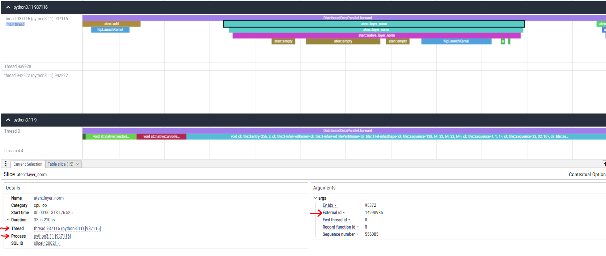

# Trace2Tree

In GPU applications performance analysis, understanding the relationship between host CPU operations and correspondng GPU kernel executions is crucial for analysing bottlenecks. The PyTorch profiler provides a JSON trace file containing events with timestamps and durations but lacks explicit call stack dependency information.

Trace2Tree is a Python SDK designed to parse these trace files and build a hierarchical tree structure that represents the dependency relationships from host CPU operations to GPU kernels. This enables users to analyze and extract insights, such as the total GPU kernel time for a high-level host function (e.g., aten::linear), and perform many other advanced analyses leveraging the tree structure.

---

## Key Features

- **Hierarchical Dependency Tree**: Constructs a tree structure linking CPU operations to GPU kernel launches, enabling detailed analysis of the ops lowering and perfomance.
- **Extensible SDK**: Provides a framework for custom analyses, such as identifying GPU time for CPU operations or pinpointing bottlenecks.
- **Lightweight Design**: Minimal dependencies and a straightforward codebase for easy integration and use.
- **PyTorch Support**: Built for PyTorch profiler JSON traces, with potential for future support of other frameworks.

---

## Quick Start

### Example 1: Build and traverse tree

#### 1. Load the Trace data
```python

import json
from pprint import pprint
from TraceLens import TraceToTree

# Load trace data
trace_file = '/path/to/trace.json'
with open(trace_file, 'r') as f:
    trace_data = json.load(f)

events = data['traceEvents']
tree = TraceToTree(events)
tree.build_tree()
```
#### 2. Locate node from Perfetto UI  
Note External Id, Process Id and Thread Id


#### 3. Get the Node by Its Identifiers

```python
node = tree.get_node_by_ext_id_pid_tid(14990986, 937116, 937116)
pprint(node)
```

```
{'UID': 103700,
 'args': {'Ev Idx': 95372,
          'External id': 14990986,
          'Fwd thread id': 0,
          'Record function id': 0,
          'Sequence number': 556085},
 'cat': 'cpu_op',
 'children': [103701],
 'cpu_op_root': True,
 'dur': 33.21,
 'name': 'aten::layer_norm',
 'parent': None,
 'ph': 'X',
 'pid': 937116,
 't_end': 3962902441202.784,
 'tid': 937116,
 'tree': True,
 'ts': 3962902441169.574}
```

#### 4. Recursively Traverse the Tree

```python

tree.traverse_and_print(node)
```

```
└── Category: cpu_op, Name: aten::layer_norm
    └── Category: cpu_op, Name: aten::layer_norm
        └── Category: cpu_op, Name: aten::native_layer_norm
            ├── Category: cpu_op, Name: aten::empty
            ├── Category: cpu_op, Name: aten::empty
            ├── Category: cpu_op, Name: aten::empty
            ├── Category: cuda_runtime, Name: hipLaunchKernel
            │   └── Category: kernel, Name: void at::native::(anonymous namespace)::vectorized_layer_norm_ke...
            ├── Category: cpu_op, Name: aten::view
            └── Category: cpu_op, Name: aten::view

```
#### 5. Traverse Upwards to Analyze Parent Nodes

```python
node = tree.get_node_by_ext_id_pid_tid(14990988, 9, 0)
parent = node
depth = 0

tree.traverse_parents_and_print(node)
```
```
Node:
  cat: kernel
  name: void at::native::(anonymous namespace)::vectorized_layer_norm_ke...
1-up:
  cat: cuda_runtime
  name: hipLaunchKernel
2-up:
  cat: cpu_op
  name: aten::native_layer_norm
3-up:
  cat: cpu_op
  name: aten::layer_norm
4-up:
  cat: cpu_op
  name: aten::layer_norm
```